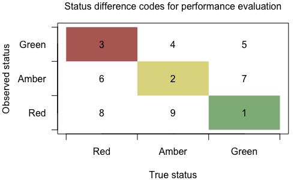

Evaluating the consequences of assumptions in run-reconstructions when assessing the biological status of salmon
================
Stephanie Peacock
2018-12-24

Motivation
==========

The [Pacific Salmon Foundation (PSF)](http://www.psf.ca) has recently led efforts to quantify the biological status of Pacific salmon Conservation Units (CUs) on British Columbia’s (BC) north and central coast, following the approaches outlined under Canada’s Wild Salmon Policy. In this work, the PSF has evaluated current biological status using two metrics and associated benchmarks: 1) historic spawner abundance and 2) the shape of the stock-recruitment relationship ([Connors et al. 2018](https://salmonwatersheds.ca/library/lib_442/)).

In order to evaluate biological status using stock-recruitment benchmarks, a continuous time-series of spawner abundance and recruitment is needed for each CU. However, not every stream within a CU is monitored each year and, in most cases, run reconstruction analyses must be undertaken in order to estimate the total number of spawners within a CU, determine harvest rates, and generate CU-level estimates of recruitment. The PSF has contracted [LGL Ltd.](http://www.lgl.com) for the past 10 years to work with north coast Fisheries and Oceans Canada (DFO) stock assessment biologists to reconstruct estimates of spawner abundance and recruitment for each salmon CU in the region ([English et al. 2012](https://salmonwatersheds.ca/library/lib_1/), [2016](https://salmonwatersheds.ca/library/lib_435/)).

Generating these run reconstructions generally involves multiplying the observed number of spawners for all streams within a CU by three separate ‘expansion factors’ to account for: (I) indicator streams that are not monitored in a given year, (II) non-indicator streams that are rarely monitored, and (III) observer efficiency. In order to estimate harvest rates, assumptions about the migration routes and run-timing of harvested salmon are made to assign catch – recorded at the level of Statistical Areas (SAs) – to different CUs. Finally, assumptions about the age-at-return of spawners in any given year may be required to calculate recruitment. The combined influence of these assumptions on our ability to accurately assess the status of CUs is unknown. The objective of this project is to understand the consequences of common assumptions in run reconstructions surrounding expansion factors, harvest rates, and age-at-return on status assessments and the circumstances under which they may bias the kinds of assessments of biological status undertaken by the PSF.

Assumptions in run reconstruction
---------------------------------

The specific assumptions made in reconstructing spawner, harvest, and resulting recruitment time-series may differ among species and even among CUs within a species due to differences in, for example, the spatial resolution of catch data, run-timing variability, or additional data such as from CWTs (see Appendix E of [English et al. (2016)](https://salmonwatersheds.ca/library/lib_435/) for details). For this project, we consider a generic central coast chum CU, where harvest rules are relatively simple and a constant age-at-return is assumed. The main assumptions in the run reconstruction that we are focusing on are:

1.  The relative contribution of each indicator stream to aggregate spawner abundance for the CU does not vary through time. Under this assumption, observed spawner abundance is multiplied by Expansion Factor I to account for indicator streams that were not monitored in a given year. Expansion Factor I is calculated based on the current decade or, if an indicator stream is not monitored in that decade, on the closest decade that has at least one escapement estimate from each indicator stream.

2.  The relative contribution of each non-indicator stream to aggregate spawner abundance for the CU does not vary through time. Under this assumption, the estimated spawner abundance to all indicator-streams is multiplied by Expansion Factor II to account for non-indicator streams. Expansion Factor II is calculated based on the decade with the best survey coverage (indicator and non-indicator) for that CU.

3.  Observer efficiency is constant over time for a given CU. Under this assumption, the estimated spawner abundance in both indicator and non-indicator streams is multiplied by Expansion Factor III to account for imperfect observer efficiency. Expansion Factor III is based on expert opinion of regional DFO staff familiar with escapement monitoring techniques and is constant over time within a CU.

4.  Salmon harvested within a SA were destined to spawn in streams within that SA in proportion to the escapement to each stream, and salmon returning to a SA were not caught in other SAs. Under this assumption, harvest rates are calculated from catch within a single SA and estimated total escapement to the CU. Violation of this assumption would result in over- or under-estimation of harvest rates.

5.  Average age composition based on available data is representative of year-specific age composition of returns.

The project will quantify the consequences of these assumptions for the accuracy and precision of benchmarks and, ultimately, status assessments under a base case that corresponds to the historical conditions for central coast chum (e.g., historical monitoring coverage, trends in covariance among subpopulations, and changes in harvest rates).

Files
=====

Further details on the model and how these functions are used are given in the *Model description* below. The following just outlines the contents of each file, in a nutshell. Functions are documented in `roxygen2` style to facilitate conversion to an R package at some point.

-   `runSim.R` is a temporary R file that contains snippits of code for me to test the `reconstSim` function and look at output. Warning: this is just for my own playing around and is not well commented!
-   `reconstrSimulator.R` contains the `reconstSim` function that runs a single MCMC simulation of salmon population dynamics, observation, and assessment, and returns the observed and true status as well as performance metrics.

The functions called by `reconstrSim` that comprise the simulation model are organized into files based on the submodel that they correspond to:

-   `populationSubmodFns.R` constains functions
    -   `rickerModel` that simulates the Ricker model
    -   `ppnAgeErr` that simulates the proportion of fish returning at ages 2-6 (by brood year) with error
-   `obsSubmodFns.R` contains functions
    -   `samplingDesign` that simulates the partial monitoring of indicator and non-indicator streams within the CU, with the option of incorporating change in monitoring effort over time
-   `expansionFactors.R` contains functions
    -   `refDecade` that selects a reference decade from which to calculate relevant expansion factors (as per `ExpFactor1RefDecade` from the NCCSDB packaage)
    -   `ExpFactor1` that calculates the value of Expansion Factor 1 for each year and decade
    -   `ExpFactor2` that calculates the value of Expansion Factor 2 for each decade
-   `benchmarkFns.R` contains functions
    -   `calcSmsy` that calculates *S**M**S**Y* (i.e., upper SR benchmark) given Ricker parameters, using the explicit solution from Scheuerell (2016)
    -   `Sgen.optim` that calculates the likelihood of residuals between the projected recruits from an estimated *S**G**E**N*1 (`Sgen.hat`) and a known value of *S**M**S**Y*, to be used in the optimization of *S**G**E**N*1.
    -   `calcSgen` that calculates *S**G**E**N*1 by optimizing `Sgen.optim`
    -   `assessMetric` that returns the status given current abundance and upper and lower benchmarks on a given metric
    -   `assessPop` that returns a population assessment based on both SR and percentile metrics of spawners abundance, to be applied to either observed or true spawners and recruits
-   `performanceFns.R` contains function
    -   `perfStatus` that takes the true and observed status output from `assessPop` and returns the bias (raw mean error) in benchmarks (observed - true) and the status code 1-9, which tells whether the final status (green (1), amber (2), or red (3)) was the same for true and observed or different, and if they were different, how they differed.
-   `plottingFns.R` contains functions to plot the output of simulations, including
    -   `plotStatusDiff` that produces a 3 x 3 matrix plot with the proportion of MCMC simulations giving green, amber, or red status in both true (x-axis) and observed (y-axis) data.

Details of all functions can be found in their respective files.

Model description
=================

The R code in this repository simulates a stochastic model of salmon population dynamics, allowing control over various biological and management factors that may influence the accuracy of status assessments. This model is based on previous studies by Carrie Holt and colleagues (e.g., [Holt and Folkes 2015](http://dx.doi.org/10.1016/j.fishres.2015.01.002), Holt et al. 2018) that developed different versions of a simulation model, comprised of sub-models for salmon population dynamics, observation of spawners, assessment, harvest, and performance (Fig. 1), in order to evaluate approaches to salmon population assessment and management.

.](model.png)

Running a simulation
--------------------

The `recoverySim` function found in `reconstrSimulator.R` runs a single MCMC simulation of the model outlined in Fig. 1. The various parameters and controls are passed to this function in a named vector called `simPar` that can be read from a .csv file. Several examples of parameters used in the simulations for this project can be found in the `Data` folder. The following description outlines the components within the `recoverySim` function, relating parts of the code to the mathematical equations for population dynamics, observation, and assessment of the hypothetical chum salmon CU. **Note that the equations may not display properly in the GitHub markdown doc, in which case refer to the README.pdf version of this document.**

Population sub-model
--------------------

The population dynamics of multiple sub-populations, *j*, designated as indicator or non-indicator streams, are simulated within a single hypothetical CU following a Ricker type stock-recruitment relationship, with parameters based on observations from central coast chum CUs ([Connors et al. 2018](https://salmonwatersheds.ca/library/lib_442/)). The true population dynamics are simulated in a loop over `nYears`, with calculations done in vectors across subpopulations.

The first loop is an initialization that calculates the recruits by brood year `recruitsBY`, *R**y*, *j*′, for years 1 to `gen + 2`, where `gen` is the number of different ages fish can return at. These values are needed in order to calculate the first recruits by return year `recruitsRY`, which includes recruits that return as age 3, 4, or 5 year olds in the case of chum salmon (the model is flexible to incorporate the possible of 2 and 6 year olds returning too). For each year in this initialization, we assumed that the number of spawners was equal to 20% of equilibrium spawner abundance, *S**j*\* = *a**j*/*b* for subpopulation *j* (Holt et al. 2018 CSAS).

The second loop simulates the true population dynamics from year `gen + 3` to `nYears`. The number of salmon in **return year *t*** and subpopulation *j*, *R**t*, *j*, is calculated as:

*R**t*,  *j* = *R*′*t* − 3,  *j* *p**t* − 3,  3 + *R*′*t* − 4,  *j* *p**t* − 4,  4 + *R*′*t* − 5,  *j* *p**t* − 5,  5

where *p**y*, *g* is the proportion of recruits from **brood year *y*** returning as *g* year olds. (Throughout, we use *R* to denote returns, or catch plus escapement of fish returning in a year, and *R*′ to denote recruitment, or the number of offspring from a brood year that survive to return to spawn over several years (due to variable age-at-return).) Note that we assume that the proportion of recruits returning at a given age is the same among subpopulations, but incorporate interannual variability as in Holt et al. (2018 CSAS):

$$ p\_{y,g} = \\frac{\\bar{p}\_g \\! \\exp ({\\bar{\\omega} \\, \\varepsilon\_{y,g}})}{\\sum\_{G = 3}^{5} \\bar{p}\_G \\! \\exp ({\\bar{\\omega} \\, \\varepsilon\_{y,G}})} $$

In the model, this is coded as:

    recruitsRY[y, ] <- ppnAge[cbind(y - ages, 1:simPar$gen)] %*% recruitsBY[y - ages,]

where the `ppnAge` matrix incorporating natural interannual variability is calculated prior to the population dynamics loop using the `ppnAgeErr` function.

The number of spawners **returning in year *t*** is the number of returning salmon *R**t*, *j* times 1 − *h**t*, where *h**t* is the realized harvest rate for year *t*. We assume a predetermined target harvest rate, *h**t*′, but incorporate normally distributed error around that:

*h**t* ∼ *N*(*h**t*′,  *σ**h*)

with the constraint that 0 &lt; *h**t* &lt; 1. If *h**t* ≤ 0 or *h**t* ≥ 1, we drew another random *h**t* until this condition was satisdied. As with the `ppnAge`, we assume the same harvest rate among subpopulatins and the vector of harvest rates `harvestRate` is calculated prior to the population dynamics loop and then applied within.

The number of fish **returning to spawn in year *t*** and subpopulation *j* is calculated as:

*S**t*, *j* = (1 − *h**t*) *R**t*, *j*

or in R code:

    spawners[y, ] <- harvestRate[y] * recruitsRY[y, ]

The true total catch of fish that would have returned to streams within the CU is calculated as:

*C**t* = (1 − *h**t*) ∑*j**R**t*, *j*

For this project, we ignore potential straying of returning adults among subpopulations that was included in some previous analyses (e.g., Holt et al. 2018 and [Peacock & Holt 2012](http://www.nrcresearchpress.com/doi/full/10.1139/f2012-004)).

Finally, to calculate the number of recruits from **brood year *y*** and subpopulation *j*, we apply the Ricker model:

*R*′*y*, *j* = *S**y*, *j* exp(*a**j* − *b* *S**y*, *j*) exp(*ϕ**y*, *j*)

where *a**j* is the log recruits per spawner at low spawner abundance (i.e., productivity), which is assumed to be normally distributed among subpopulations with some mean $\\bar{a}$ and variance *σ**a*2, density-dependence parameter *b*, which is assumed to be the same among all subpopulations, and *ϕ**y*, *j* are the recruitment deviations for year *y* and subpopulation *j*. We incorporated temporal autocorrelation in recruitment residuals:

*ϕ**y*, *j* = *ρ* *ϕ**y* − 1, *j* + *υ**y*, *j*

where *ρ* is the temporal autocorrelation coefficient and *υ**y*, *j* is drawn from a multivariate normal distribution with means zero (**right? I think Cam mentioned they are no longer using the lognormal correction here?**) and variance-covariance matrix:

$$ \\Sigma\_{j \\times j} = \\left\[ \\begin{array} {cccc}
\\; \\sigma^2\_{\\upsilon} & \\rho\_{\\upsilon} \\, \\sigma^2\_{\\upsilon} & \\ldots & \\rho\_{\\upsilon} \\, \\sigma^2\_{\\upsilon} \\\\
\\rho\_{\\upsilon} \\, \\sigma^2\_{\\upsilon} & \\sigma^2\_{\\upsilon} & \\ldots & \\rho\_{\\upsilon} \\, \\sigma^2\_{\\upsilon} \\\\
\\vdots & \\vdots & \\ddots & \\vdots \\\\
\\rho\_{\\upsilon} \\, \\sigma^2\_{\\upsilon} & \\rho\_{\\upsilon} \\, \\sigma^2\_{\\upsilon} & \\ldots & \\sigma^2\_{\\upsilon} \\\\ 
\\end{array} \\right\]\_{j \\times j} $$

**Question: I think *ρ**υ* (autocorrelation among subpopulations) is different from *ρ* (temporal autocorrelation), but this is not clear in Holt et al. (2018 CSAS) equations (F7). Check.** Here, *σ**υ* is the standard deviation in residuals without autocorrelation (Rickery 1975, Holt and Bradford 2011) and ***ρ**υ* is the "spatial" autocorrelation among subpopulations.** In the initialization loop, we assumed that *ϕ**y* = 1, *j* = 0.

The calculation of recruits is done in the model using the `rickerModel` function, and the resulting recruits and recruitment deviations are stored in matrices `recruitsBY` and `phi`, respectively.

Observation sub-model
---------------------

Spawner abundances are observed with probability, *p**y*, *j*. Depending on the scenario, this probability may be constant over time, or incorporate some change in monitoring effort (e.g., a decline in the probability of being sampled at some point in time or over a period of time). **For now, I have assumed that the sampling probability is the same for indicator and non-indicator streams, but this may need to be changed. Note that the observed spawner abundance for non-indicator streams is not used in the calculation of aggregate spawner abundance to the CU except for the calculation of the second expansion factor. ** In R, this sampling design is applied by the function `samplingDesign`, which takes a base value for *p*, as well as a change in *p* and a start and end year over which that change is applied. Observed spawner abundance incorporates log-normal observation error:

$$ \\hat{S}\_{y,j} = z\_{y,j} \\; \[ S\_{y,j} \\; \\exp (\\delta\_{y,j}) \] $$

where *z**y*, *j* ∼ Bernoulli(prob = *p**y*, *j*), *δ**y*, *j* ∼ *N*(0, *σ**δ*2), and *σ**δ* is the standard deviation in observation error of spawner abundances.

The observed catch to the entire CU in return year *t* is observed with log-normal error:

$$ \\hat{C}\_{t} = C\_{t} \\; \\exp (\\chi\_{t}) $$

where *χ**t* ∼ *N*(0, *σ**χ*2), and *σ**χ* is the standard deviation in catch error. **If we wanted to incorporate a bias in catch** to simulate a scenario where 1. fish are caught from other CUs, or 2. fish from the focal CU that were caught in other fisheries, then we could introduce a positive or negative mean in catch error, but for now I have left as zero.

For this project, we are assuming average age-at-return is applied in run reconstruction, but this "observed age-at-return" may have error associated with it. Previous models (e.g., Holt et al. 2018 CSAS) have included error in the "estimated age-at-return" for each return year, where the mean is the true age-at-return, but for the central coast chum, annual age-at-return data are rarely available and so the average is used. We apply observation error to get an average age-at-return that is applied in run reconstruction:

$$ \\hat{pr}\_{g} = \\frac{\\bar{p}\_g \\! \\exp ({\\bar{\\omega}\_{pr} \\, \\varepsilon\_{g}})}{\\sum\_{G = 3}^{5} \\bar{p}\_G \\! \\exp ({\\bar{\\omega}\_{pr} \\, \\varepsilon\_{G}})} $$

where $\\bar{p}\_g$ is the average age-at-return applied in the population submodel. **There are several other possible approaches here that might make more sense:** 1. minor variation: use the average of the true ages `ppnAge` as the means; 2. sub-sample from the true porportion `ppnAge` in some way that reflects the actual number of years that are used in these calculations. 3. sub-sample from the true porportion `ppnAge` AND apply observation error, then calculate mean. **Discuss with Cam.**

Assessment sub-model
--------------------

### Expansion factors

For stock-recruit benchmarks, time-series of aggregate spawners to the CU and catch are needed in order to calculate recruitment for a given brood year. For chum salmon that can return as 3, 4, or 5 year-olds, these time-series need to be continuous as one year of missing data will result in multiple years of missing stock-recruit pairs. In order to calculate harvest rates from the total onserved catch, $\\hat{C}\_{t}$, an estimate of the total number of spawners is required from indicator streams, non-indicator streams, and streams not monitored. To get this, the observed number of spawners from indicator streams is multiplied by three expansion factors. In the model, each of these expansion factors is calculated and applied separately using functions derived from LGL's North & Central Coast Salmon Database (NCCSDB) package (Challenger 2018).

Expansion Factor I, *F*′*y*/*d*, expands the observed spawner abundances in indicator streams to account for indicator streams that are not monitored in a given year. It is calculated for each year *y* within deacde *d* of the spawner time series, and relies on a decadal contribution of each indicator stream to the total escapement to all indicator streams (*P**d*, *i*). The calculation of this decadal contribution requires at least one estimate from each indicator stream for the decade. If a decade does not contain sufficient information (i.e., one or more indicator streams are not monitored at all in a decade), then a reference decade is used to calculate *P**d*, *i*. This reference decade is chosen using the `refDecade` function found in `expansionFactors.R` based on the criteria of the `ExpFactor1RefDecade` function in the NCCSDB package (Challenger 2018). Specifically, the reference decade is chosen to be: 1. The closest decade (historical or future) with sufficient information. 2. Failing (1), select the 20-year period from 1980-1999.

For each decade (or reference decade if insufficient information) *d*, the `ExpFactor1` function calculates the average number of spawners returning to indicator stream *i* in decade *d* as:

$$ \\bar{S}\_{d,i} = \\frac{\\sum\_{y=1}^{Y\_{d,i}} \\hat{S}\_{y/d,i}}{Y\_{d,i}} $$

where *Y**d*, *i* is the number of years for which spawner estimates are available within decade *d* for stream *i*. From the average number of spawners for all indicator streams, the decadal proportional contribution of each indicator stream is calculated as:

$$ P\_{d,i} = \\frac{\\bar{S}\_{d,i}}{\\sum\_{i=1}^I \\bar{S}\_{d,i}} $$

where *I* is the total number of indicator streams.

Expansion Factor I is then calculated for each year within the decade *y*/*d* based on the decadal contributions and which streams were monitored or not in a given year:

$$ F'\_{y/d}  = \\left(\\sum\_{i=1}^I \\left\\{ P\_{d,i} \\; w\_{y/d,i} \\right\\} \\right) ^{-1}$$

where *w**y*/*d*, *i* is 1 if stream *i* is monitored in year *y* and 0 if stream *i* is not monitored in year *y*. The value of *F*′*y*/*d* returned by the `ExpFactor1` function is then multiplied by the sum of the observed spawners in all indicator streams to yield the expanded estimate of spawner abundances in all indicator streams for the CU:

$$ S'\_{y/d} = F'\_{y/d} \\sum\_{i=1}^I \\hat{S}\_{y,i}. $$

Expansion Factor II, *F*″*d* expands the escapement to all indicator streams, *S*′*y*, to account for non-indcator streams. Unlike Expansion Factor I, this is calculated for each decade (rather than each year) and then applied to all years within a decade. Like Expansion Factor I, there needs to be sufficient information within the given decade in order to calculate *F*″*d*, or else a reference decade is chosen. **Currently, the criteria for a decade to have 'sufficient information' is the same for Expansion Factor I: that each *indicator* stream must be monitored at least once within a decade. This was based on the documentation in the `ExpansionFactor2` function in the NCCSDB manual, but it was not entirely clear from that documentation what constituted 'sufficient information'.** Expansion Factor II is returned by the `ExpFactor2` function, and calculated as:

$$ F^{''}\_{d} = \\frac{\\sum\_{i=1}^I \\bar{S}\_{d,i} + \\sum\_{j=1}^J \\bar{S}\_{d,j}}{\\sum\_{i=1}^I \\bar{S}\_{d,i}}$$

where $\\bar{S}\_{d,i}$ and $\\bar{S}\_{d,j}$ are the deacdal average number of spawners in indicator and non-indicator streams, respectively, calculated as given above for Expansion Factor I. *J* is the total number of non-indicator streams. \*\* Note this equation differs from that given for the `ExpansionFactor2` function in the NCCSDB manual which shows a different value of Expansion Factor II for each year, y, but I think that's wrong...\*\* The adjusted total number of spawners in both indicator and non-indicator streams is then calculated as:

*S**y*/*d*″ = *F**d*″ *S**y*/*d*′

Finally, the number of spawners to both indicator and non-indicator streams, $ S^{''}\_{y/d}$ is multiplied by Expansion Factor III to account for streams that are never monitored and for observer (in)efficiency. Expansion Factor III is determined by the regional DFO staff familiar with the escapement monitoring techniques used in each statistical area and is given as *F*‴ = 1.5 for all north and central coast chum CUs in Table A3 and A4 of [English et al. (2016)](https://salmonwatersheds.ca/library/lib_435/). In the model, `ExpFactor3` is supplied in the `simPar` parameters passed to the `recoverySim` function. The final expanded number of spawners (i.e., escapement) to the CU for year *y* is given by *S**y*‴ = *F*‴*S**y*/*d*″. **Need to account for this observer (in)efficiency in the 'true' dynamics. E.g., by simualting 1.5 (or some close number) the number of streams that are never monitored and/or adding a bias into the observation error so that spawners are underestimated. Discuss with Katrina and Eric.**

### Reconstructing recruitment

The observed number of salmon returning in year *t* is the sum of observed catch and expanded escapement to the CU:

$$ \\hat{R}\_t = \\hat{C}\_t + S^{'''}\_{t}$$
 Observed recruitment for brood year *y* (`obsRecruitsBY`) is then calculated as the sum of age 3, 4, and 5 fish returning in years *y* + 3, *y* + 4, and *y* + 5, respectively:

$$ \\hat{R}^{'}\_{y} = \\hat{R}\_{y+3} \\hat{pr}\_{3} + \\hat{R}\_{y+4} \\hat{pr}\_{4} + \\hat{R}\_{y+5} \\hat{pr}\_{5},$$

yielding the reconstructed spawner-recruit pairs for brood year *y*: *S**y*‴ (`spawnersExp3`) and $\\hat{R}^{'}\_{y}$ (`obsRecruitsBY`).

### Calculating benchmarks

Upper and lower benchmarks for the stock-recruit and percentile metrics are calculated from both the reconstructed spawner-recruit pairs (above) and the "true" data. **For now, I am using the full spawner data wihtout observation error (`spawners`) and the true recruits by brood year (`recruitsBY`), removing the first 7 years of initialization, but if one wanted to assess the effect of different expansion factors independently, then other "true" datasets may be used.** These benchmarks are outlined below for completeness, but descriptions can also be found elsewhere (e.g., [Connors et al. 2018](https://salmonwatersheds.ca/library/lib_442/), Holt et al. 2018).

#### Stock-recruit benchmarks

In order to calculate stock-recruit benchmarks, a simplified version of the Ricker model presented above is fit to the data using linear regression to estimate parameters $\\hat{a}$, $\\hat{b}\_{CU}$, and *σ**ϵ* for the CU:

log(*R**y*/*S**y*)=*a* − *b**C**U**S**y* + *ϵ**y*
 where *R* is recruitment to the entire CU from brood year *y*, *S**y* is the spawner abundance for the entire CU in year *y*, and *ϵ**y* ∼ *N*(0, *σ**ϵ*) is combined observation and process error. (Density dependence parameter *b**C**U* is used to distinguish from the population-specific parameters *b**i* applied in the population submodel.)

The upper stock-recruit benchmark is *S**M**S**Y*, or the spawner abundance, or the spawner abundance projected to maintain long-term maximum sustainable yield from a population with Ricker dynamics. *S**M**S**Y* is calculated from the estimated Ricker parameters as:

$$S\_{MSY} =  \\frac{1 - W(e^{1 - \\hat{a})}{\\hat{b}\_{CU}}$$

where *W*(*z*) is the Lambert W function [(Scheuerell 2016)](https://peerj.com/articles/1623). We calculate *S**M**S**Y* using the `calcSmsy` function, which draws on the `lambert_W0` function from the `gsl` library [(Hankin 2006)](https://cran.r-project.org/web/packages/gsl/vignettes/gslpaper.pdf).

The lower stock recruit benchmark is *S**G**E**N*1, or the spawner abundances that would result in recovery to *S**M**S**Y* within one generation. There is no explicit solution for *S**G**E**N*1, and so we use numerical optimization (`optimize` in R) to minimize the difference between *S**M**S**Y* above and the projected $\\hat{S}\_{MSY}$ for proposed values of *S**G**E**N*1 over the interval (0, *S**M**S**Y*). See `Sgen.optim` and `calcSgen` functions.

#### Percentile benchmarks

The upper and lower benchmarks for the percentile metric are simply the 25% and 75% quantiles of historic spawner abundance (e.g., *S**y*‴ or `spawnersExp3` in the case of observed data), calculated using the `quantile` function.

#### Assessing population status

To assess the population (i.e., CU) as red, amber, or green, the geometric mean spawner abundance over the most recent generation (i.e., 5 years for chum salmon) is compared to the upper and lower benchmarks for each metric using the stoplight approach outlined in Canada's Wild Salmon Policy [(DFO 2005)](https://www.pac.dfo-mpo.gc.ca/fm-gp/species-especes/salmon-saumon/wsp-pss/policy-politique/index-eng.html). In the code, this is done by applying the `assessPop` function to true and observed (i.e., reconstructed) stock-recruit data, yielding the status assessments and benchmark values for true and observed cases.

Performance sub-model
---------------------

Performance is evluated using two metrics that capture the difference between observed and true status assessments:

1.  Bias (mean raw error; observed - true) and precision (mean absolute error) of derived benchmarks (upper and lower for both percentile and stock-recruitment);

2.  Percentage of simulations where status is erroneously assigned to red, amber, and green status zones. For this performance metric, we distinguish errors in assessment that over- and under-estimate status by assigning the following "status codes" that can be analysed in various ways (Fig. 2).

In practice, we are interested in the combined impact of all run-reconstruction assumptions on status assessments, and so observed status will be compared to the true status given perfect knowledge of spawner abundances and true recruitment to the CU. \*\*However, in order to inform future modelling work and/or data collection, we will also separate the relative impact of the different assumptions by comparing observed status to different baselines. For example, in order to isolate the impact of Expansion Factor III for observer efficiency, the observed status can be compared to the status calculated with zero observation error but the same monitoring coverage, harvest rates, and age-at-return assumptions. How to isolate the impact of different assumptions and sources of variability will require careful consideration, and has yet to be implemented in the model\*
