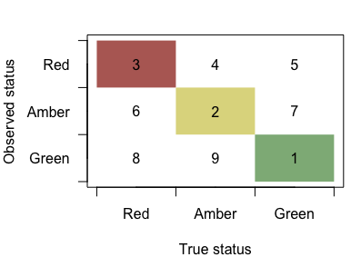

Model description
================
Stephanie Peacock
2019-05-01

The R code in this repository simulates a stochastic model of salmon population dynamics, allowing control over various biological and management factors that may influence the accuracy of status assessments. This model is based on previous studies by Carrie Holt and colleagues (e.g., [Holt and Folkes 2015](http://dx.doi.org/10.1016/j.fishres.2015.01.002), Holt et al. 2018) that developed different versions of a simulation model, comprised of sub-models for salmon population dynamics, observation of spawners, assessment, harvest, and performance (Fig. 1), in order to evaluate approaches to salmon population assessment and management.

.](model.png)

Running a simulation
--------------------

The `recoverySim` function found in `reconstrSimulator.R` runs a single MC simulation of the model outlined in Fig. 1. The various parameters and controls are passed to this function in a named vector called `simPar` that can be read from a .csv file. Several examples of parameters used in the simulations for this project can be found in the `data` folder. The following description outlines the components within the `recoverySim` function, relating parts of the code to the mathematical equations for population dynamics, observation, and assessment of the hypothetical chum salmon CU. **Note that the equations may not display properly in the GitHub markdown doc, in which case refer to the modelDescription.pdf version of this document.**

Setup
-----

First, several parameters from the `simPar` vector that are used frequently throughout the model are detached in the function workspace. Then, the true Ricker parameters for each subpopulation are drawn randomly from distributions defined by the `simPar` parameters. Note that productivity is limited to *a**j* &gt; 0.4 so that the application of SR benchmarks is appropriate. Values of *S*MAX, *j* = 1/*b**j* are drawn from a lognormal distribution that differs for indicator and non-indicator streams, because indicator streams have significantly higher numbers of spanwers on average.

We incorporated a potential decline in capacity, *S*MAX, *j*, in response to the cumulative habitat pressures within watersheds in which central coast chum salmon spawn ([Connors et al. 2018](https://salmonwatersheds.ca/library/lib_442/)). We defined three different severities of decline: a linear reduction in *S*MAX, *j* between 50% and 75% (severe risk associated with red habitat status), between 25% and 50% (moderate risk associated with amber habitat statis), and no chnge in *S*MAX, *j* over the simulation (low risk associated with green habitat status). The exact percent decline for each subpopulation was randomly drawn from a uniform distribution within the above range for each MC simulation. The proportions of subpopulations in each category were dictated by the `redHab`, `amberHab`, and `greenHab` parameters given in `simPar`.

The proportion of spawners from a given brood year that matured at ages 3, 4, or 5 was calculated for each year of the simulation outside of the Population sub-model (see below).

Similarly, the realized harvest rate could be drawn outside of the Population submodel for simulations with a constant target harvest; if target harvest rate depended on the total return to the CU, then the target had to be calculated each year within the Population submodel but the vector to store these values is setup here.

Finally, the variance-covariance matrix for the Ricker residuals is created from the within-subpopulation variance `sigma_u` and correlation among subpopulations `correlPop`. Note that this variance-covariance matrix must be semi-positive definite and an error will be thrown if this is not the case.

Population sub-model
--------------------

The population dynamics of multiple sub-populations, *j*, designated as indicator or non-indicator streams, are simulated within a single hypothetical CU following a Ricker type stock-recruitment relationship, with parameters based on observations from central coast chum CUs ([Connors et al. 2018](https://salmonwatersheds.ca/library/lib_442/)).

The true population dynamics are simulated in a `for` loop over `nYears`. The first loop is an initialization that calculates the recruits by brood year `recruitsBY`, *R**y*, *j*′, for years 1 to `gen + 2`, where `gen` is the number of different ages fish can return at (we consider `gen` = 5 as chum have been known to return at ages 2, 3, 4, 5, and 6 - although the proportion that return at ages 2 and 6 is assumed to be zero in our simulations). These values are needed in order to calculate the first recruits by return year `recruitsRY`, which includes recruits that return as age 3, 4, or 5 year olds in our case (the model is flexible to incorporate the possible of 2 and 6 year olds returning, too). For each year in this initialization, we assumed that the number of spawners was equal to 20% of maximum spawner abundance, *S*MAX, *j* = 1/*b**j* for subpopulation *j*.

The second loop simulates the true population dynamics from year `gen + 3` to `nYears`. The number of salmon returning to spawn in **return year *t*** and subpopulation *j*, *R**t*, *j*, is calculated as:

*R**t*,  *j* = *R*′*t* − 3,  *j* *p**t* − 3,  3 + *R*′*t* − 4,  *j* *p**t* − 4,  4 + *R*′*t* − 5,  *j* *p**t* − 5,  5

where *p**y*, *g* is the proportion of recruits from **brood year *y*** returning as *g* year olds (i.e., age-at-maturity for **brood year *y***). Throughout this model description, we use *R* to denote returns, or catch plus escapement of fish returning in a year, and *R*′ to denote recruitment, or the number of offspring from a brood year that survive to return to spawn over several years (due to variable age-at-return). We assume that the proportion of recruits returning at a given age is the same among subpopulations, but incorporate interannual variability as in [Holt et al. (2018)](http://www.dfo-mpo.gc.ca/csas-sccs/Publications/ResDocs-DocRech/2018/2018_011-eng.html):

$$ p\_{y,g} = \\frac{\\bar{p}\_g \\! \\exp ({\\bar{\\omega} \\, \\varepsilon\_{y,g}})}{\\sum\_{G = 3}^{5} \\bar{p}\_G \\! \\exp ({\\bar{\\omega} \\, \\varepsilon\_{y,G}})} $$

In the model, this is coded as:

    recruitsRY[y, ] <- ppnAge[cbind(y - ages, 1:simPar$gen)] %*% recruitsBY[y - ages,]

where the `ppnAge` matrix incorporating natural interannual variability is calculated prior to the population dynamics loop using the `ppnAgeErr` function (see Setup, above).

The number of salmon that escape the fishery and return to spawn **in return year *t*** is the number of returning salmon *R**t*, *j* times 1 − *h**t*:

*S**t*, *j* = (1 − *h**t*) *R**t*, *j*,

where *R*(*t*, *j*) is the number of returning salmon and *h**t* is the realized harvest rate for the entire CU in year *t*. We incorporated outcome uncertainty (i.e., deviations from the target harvest rates) by drawing the realized harvest rate each year from a Beta distribution with mean equal to a target harvest rate, *h**t*′ ([Holt and Peterman 2008](https://www.nrcresearchpress.com/doi/10.1139/F08-053)).

The model is flexible to accomodate different approaches to determining the target harvest rate. First, if `simPar$harvContRule == "variableER"`, then a simple harvest control rule (HCR) is applied where *h**t*′ increased with the total return to the CU from a minimum of 0.05 (to account for bycatch and unavoidable mortality and also avoid problems associated with low target HRs when incorporating Beta-distributed outcome uncertainty) up to an asymptote, *h*MAX ([Holt and Peterman 2008](https://www.nrcresearchpress.com/doi/10.1139/F08-053)):

*h**t*′ = *m**a**x*(*h*MAX′{1 − *e**x**p*(*d*∑*j**R**t*, *j*)}, 0.05)

where *d* is the shape parameter of the HCR. Second, the model also allow for a constant target harvest rate regardless of the total return when `simPar$harvContRule == "fixedER"`. In the run-reconstruction project, we considered a constant moderate target of *h**t*′ = *h*MAX′ = 0.42 and a constant high target of *h**t*′ = 0.60.

Each subpopulation was harvested in proportion to its abundance, such that the true total catch of fish that would have returned to streams within the CU was calculated as:

*C**t* = (1 − *h**t*) ∑*j**R**t*, *j*

For this project, we ignore potential straying of returning adults among subpopulations that was included in some previous analyses (e.g., Holt et al. 2018 and [Peacock & Holt 2012](http://www.nrcresearchpress.com/doi/full/10.1139/f2012-004)).

Finally, we assumed the spawner-recruitment dynamics followed a Ricker relationship yielding the number of recruits from brood year *y* and subpopulation *j*:

*R*′*y*, *j* = *S**y*, *j* exp(*a**j* − *b**j*, *y* *S**y*, *j*) exp(*ϕ**y*, *j*)

where *a**j* is the log recruits per spawner at low spawner abundance (i.e., productivity), which is assumed to be normally distributed among subpopulations with some mean $\\bar{a}$ and variance *σ**a*2, *b**y*, *j* is the (time-varying) density-dependence parameter, and *ϕ**y*, *j* are the recruitment deviations for year *y* and subpopulation *j*. We incorporated temporal autocorrelation in recruitment residuals:

*ϕ**y*, *j* = *ρ* *ϕ**y* − 1, *j* + *υ**y*, *j*,

where *ρ* is the temporal autocorrelation coefficient and *υ**y*, *j* is drawn from a multivariate normal distribution with means zero and variance-covariance matrix:

$$ \\Sigma\_{j \\times j} = \\left\[ \\begin{array} {cccc}
\\; \\sigma^2\_{\\upsilon} & \\rho\_{\\upsilon} \\, \\sigma^2\_{\\upsilon} & \\ldots & \\rho\_{\\upsilon} \\, \\sigma^2\_{\\upsilon} \\\\
\\rho\_{\\upsilon} \\, \\sigma^2\_{\\upsilon} & \\sigma^2\_{\\upsilon} & \\ldots & \\rho\_{\\upsilon} \\, \\sigma^2\_{\\upsilon} \\\\
\\vdots & \\vdots & \\ddots & \\vdots \\\\
\\rho\_{\\upsilon} \\, \\sigma^2\_{\\upsilon} & \\rho\_{\\upsilon} \\, \\sigma^2\_{\\upsilon} & \\ldots & \\sigma^2\_{\\upsilon} \\\\ 
\\end{array} \\right\]\_{j \\times j} $$

Here, *σ**υ* is the standard deviation in residuals without autocorrelation (Ricker 1975, Holt and Bradford 2011) and *ρ**υ* is the "spatial" autocorrelation among subpopulations (not to be confused with the temporal autocorrelation parameter, *ρ*). In the initialization loop, we assumed that *ϕ**y* = 1, *j* = 0.

The calculation of recruits is done in the model using the `rickerModel` function. There are two checks built into this function: (1) an extinction threshold such that if *S**y*, *j* &lt; `extinctThresh` then *R*′*y*, *j* = 0 and (2) a recruitment cap such that if *R*′*y*, *j* &gt; `recCap` then *R*′*y*, *j* = `recCap`. The resulting recruits and recruitment deviations are stored in matrices `recruitsBY` and `phi`, respectively.

Observation sub-model
---------------------

In any given year, sub-population *j* is observed with probability, *ψ**y*, *j*. Depending on the scenario, this probability may be constant over time, or incorporate some change in monitoring effort (e.g., a decline in the probability of being sampled at some point in time or over a period of time). In the model code, this sampling design is applied by the function `samplingDesign` separaetly for indicator and non-indicator subpopulations, because the observed trends in monitoring effort have been quite different between indicator and non-indicator streams. The `samplingDesign` function takes a base value for *ψ* for indicator (`ppnSampled_ind`) and non-indicator ((`ppnSampled_nonInd`) streams, as well as a change in *ψ* (`ppnChange_ind` and `ppnChange_nonInd`) and a start and end year over which that change is applied (`samplingDeclStart_ind` and `samplingDeclEnd_ind` and the `_nonInd` equivalents).

Spawner abundances were ‘observed’ with log-normal error:

$$ \\hat{S}\_{y,j} = z\_{y,j} \\; \[ S\_{y,j} \\; \\exp (\\delta\_{y,j}) \] $$

where *z**y*, *j* ∼ Bernoulli(prob = *ψ**y*, *j*), $\\delta\_{y,j} \\sim N(\\bar{\\delta}, \\; \\sigma\_\\delta^2)$, and *σ**δ* is the standard deviation in observation error of spawner abundances. Thus, an observation of zero spawners indicates that *z*(*y*, *j*)=0 and that subpopulation was not monitored in year *y*. We include a negative a bias in the observation of spawners ($\\bar{\\delta} \\leq 0$) such that the mean observed spawner abundance is generally lower than the true spawner abundance. This simulates the (in)efficiency of observation and motivates the application of Expansion Factor III when performing run reconstruction (described in Assessment below). The calculation of Expansion Factor I (see Expansion factors, below) requires that we impose the constraint that at least one indicator stream is monitored each year, otherwise this expansion factor is Inf. Therefore, if *z**y*, *j* = 0 for all indicator streams in a year, we randomly select one indicator stream to be monitored.

The observed catch to the entire CU in return year *t* is observed with log-normal error:

$$ \\hat{C}\_{t} = C\_{t} \\; \\exp (\\chi\_{t}) $$
 where $\\chi\_t \\sim N(\\bar{\\chi}, \\; \\sigma\_\\chi^2)$), *σ**χ* is the standard deviation in catch error, and $\\bar{\\chi}$ is a bias in catch. We assume a base case of $\\bar{\\chi}=0$, but this bias in catch can be adjusted simulate a scenario where (1) fish are caught from other CUs (catch overestimated = positive bias), or (2) fish from the focal CU that were caught in other fisheries (catch underestimated = negative bias), but for the base case simulations I have left as zero.

For this project, we are assuming average age-at-return is applied in run reconstruction, but this "observed age-at-return" may have error associated with it. Previous models (e.g., Holt et al. 2018 CSAS) have included error in the "estimated age-at-return" for each return year, where the mean is the true age-at-return, but for the central coast chum, annual age-at-return data are rarely available and so the average is used. We apply observation error to get an average age-at-return that is applied in run reconstruction:

$$ \\hat{pr}\_{g} = \\frac{\\bar{p}\_g \\! \\exp ({\\bar{\\omega}\_{pr} \\, \\varepsilon\_{g}})}{\\sum\_{G = 3}^{5} \\bar{p}\_G \\! \\exp ({\\bar{\\omega}\_{pr} \\, \\varepsilon\_{G}})} $$

where $\\bar{p}\_g$ is the average age-at-return applied in the population submodel.

Assessment sub-model
--------------------

### Expansion factors

The minimum requirement to calculate benchmarks and assess population status relative to the HS benchmarks is a time-series of spawner abundance to the CU. For SR benchmarks, harvest rates (i.e., the proportion of the total return that is caught in fisheries) must be estimated from total catch by expanding the observed spawners to indicator streams to estimate the aggregate spawner abundance to all streams in the CU. In the recent assessments of north and central coast CUs (Connors et al. 2013, 2018), three Expansion Factors have been applied to account for (1) indicator streams that are not monitored in a given year, (2) non-indicator streams that may be rarely monitored, and (3) observer (in)efficiencies and streams that have never been monitored (English et al. 2012, 2016, 2018). In the model, each of these expansion factors is calculated and applied separately using functions derived from LGL's North & Central Coast Salmon Database (NCCSDB) package (Challenger 2018).

Expansion Factor I, *F*′*y*/*d*, expands the observed spawner abundances in indicator streams to account for indicator streams that are not monitored in a given year. It is calculated for each year *y* within decade *d* of the spawner time series, and relies on a decadal contribution of each indicator stream to the total escapement to all indicator streams (*P**d*, *i*). The calculation of this decadal contribution requires at least one estimate from each indicator stream for the decade. If a decade does not contain sufficient information (i.e., one or more indicator streams are not monitored at all in a decade), then a reference decade is used to calculate *P**d*, *i*. This reference decade is chosen using the `refDecade` function found in `expansionFactors.R` based on the criteria of the `ExpFactor1RefDecade` function in the NCCSDB package (Challenger 2018). Specifically, the reference decade is chosen to be: 1. The closest decade (historical or future) with sufficient information. 2. Failing (1), select the 20-year period from 1980-1999.

For each decade (or reference decade if insufficient information) *d*, the `ExpFactor1` function calculates the average number of spawners returning to indicator stream *i* in decade *d* as:

$$ \\bar{S}\_{d,i} = \\frac{\\sum\_{y=1}^{Y\_{d,i}} \\hat{S}\_{y/d,i}}{Y\_{d,i}} $$

where *Y**d*, *i* is the number of years for which spawner estimates are available within decade *d* for stream *i*. From the average number of spawners for all indicator streams, the decadal proportional contribution of each indicator stream is calculated as:

$$ P\_{d,i} = \\frac{\\bar{S}\_{d,i}}{\\sum\_{i=1}^I \\bar{S}\_{d,i}} $$

where *I* is the total number of indicator streams.

Expansion Factor I is then calculated for each year within the decade *y*/*d* based on the decadal contributions and which streams were monitored or not in a given year:

$$ F'\_{y/d}  = \\left(\\sum\_{i=1}^I \\left\\{ P\_{d,i} \\; w\_{y/d,i} \\right\\} \\right) ^{-1}$$

where *w**y*/*d*, *i* is 1 if stream *i* is monitored in year *y* and 0 if stream *i* is not monitored in year *y*. The value of *F*′*y*/*d* returned by the `ExpFactor1` function is then multiplied by the sum of the observed spawners in all indicator streams to yield the expanded estimate of spawner abundances in all indicator streams for the CU:

$$ S'\_{y/d} = F'\_{y/d} \\sum\_{i=1}^I \\hat{S}\_{y,i}. $$

Expansion Factor II, *F*″*d* expands the escapement to all indicator streams, *S*′*y*, to account for non-indcator streams. Unlike Expansion Factor I, this is calculated for each decade (rather than each year) and then applied to all years within a decade. Like Expansion Factor I, there needs to be sufficient information within the given decade in order to calculate *F*″*d*, or else a reference decade is chosen. Expansion Factor II is returned by the `ExpFactor2` function, and calculated as:

$$ F^{''}\_{d} = \\frac{\\sum\_{i=1}^I \\bar{S}\_{d,i} + \\sum\_{j=1}^J \\bar{S}\_{d,j}}{\\sum\_{i=1}^I \\bar{S}\_{d,i}}$$

where $\\bar{S}\_{d,i}$ and $\\bar{S}\_{d,j}$ are the deacdal average number of spawners in indicator and non-indicator streams, respectively, calculated as given above for Expansion Factor I. *J* is the total number of non-indicator streams. The adjusted total number of spawners in both indicator and non-indicator streams is then calculated as:

*S**y*/*d*″ = *F**d*″ *S**y*/*d*′

Finally, the number of spawners to both indicator and non-indicator streams, $ S^{''}\_{y/d}$ is multiplied by Expansion Factor III to account for streams that are never monitored and for observer (in)efficiency. Expansion Factor III is determined by the regional DFO staff familiar with the escapement monitoring techniques used in each statistical area and is given as *F*‴ = 1.5 for all north and central coast chum CUs in Table A3 and A4 of [English et al. (2016)](https://salmonwatersheds.ca/library/lib_435/). In the model, `ExpFactor3` is supplied in the `simPar` parameters passed to the `recoverySim` function. The final expanded number of spawners (i.e., escapement) to the CU for year *y* is given by *S**y*‴ = *F*‴*S**y*/*d*″.

### Reconstructing recruitment

The observed number of salmon returning in year *t* is the sum of observed catch and expanded escapement to the CU:

$$ \\hat{R}\_t = \\hat{C}\_t + S^{'''}\_{t}$$
 Observed recruitment for brood year *y* (`obsRecruitsBY`) is then calculated as the sum of age 3, 4, and 5 fish returning in years *y* + 3, *y* + 4, and *y* + 5, respectively:

$$ \\hat{R}^{'}\_{y} = \\hat{R}\_{y+3} \\hat{pr}\_{3} + \\hat{R}\_{y+4} \\hat{pr}\_{4} + \\hat{R}\_{y+5} \\hat{pr}\_{5},$$

yielding the reconstructed spawner-recruit pairs for brood year *y*: *S**y*‴ (`spawnersExp3`) and $\\hat{R}^{'}\_{y}$ (`obsRecruitsBY`).

### Calculating benchmarks

Upper and lower benchmarks for the stock-recruit and percentile metrics are calculated from both the reconstructed spawner-recruit pairs - yielding *estimated* status - and from the underlying spawner-recruitment parameters for each subpopulation - yielding *true* status. These benchmarks are outlined below for completeness, but descriptions can also be found elsewhere (e.g., [Connors et al. 2018](https://salmonwatersheds.ca/library/lib_442/), Holt et al. 2018).

#### Stock-recruit benchmarks

In order to calculate stock-recruit benchmarks, a simplified version of the Ricker model presented above is fit to the data using linear regression to estimate parameters $\\hat{a}\_{CU}$, $\\hat{b}\_{CU}$, and *σ**ϵ* for the CU:

log(*R**y*/*S**y*)=*a* − *b**C**U**S**y* + *ϵ**y*
 where *R* is recruitment to the entire CU from brood year *y*, *S**y* is the spawner abundance for the entire CU in year *y*, and *ϵ**y* ∼ *N*(0, *σ**ϵ*) is combined observation and process error.

The upper stock-recruit benchmark is 80% of *S**M**S**Y*, or the spawner abundance projected to maintain long-term maximum sustainable yield from a population with Ricker dynamics. *S**M**S**Y* is calculated from the estimated Ricker parameters as:

$$S\_{MSY} =  \\frac{1 - W(e^{1 - \\hat{a})}}{\\hat{b}\_{CU}}$$

where *W*(*z*) is the Lambert W function [(Scheuerell 2016)](https://peerj.com/articles/1623). We calculate *S**M**S**Y* using the `calcSmsy` function, which draws on the `lambert_W0` function from the `gsl` library [(Hankin 2006)](https://cran.r-project.org/web/packages/gsl/vignettes/gslpaper.pdf).

The lower stock recruit benchmark is *S**G**E**N*1, or the spawner abundances that would result in recovery to *S**M**S**Y* within one generation. There is no explicit solution for *S**G**E**N*1, and so we use numerical optimization (`optimize` in R) to minimize the difference between *S**M**S**Y* above and the projected $\\hat{S}\_{MSY}$ for proposed values of *S**G**E**N*1 over the interval (0, *S**M**S**Y*). See `Sgen.optim` and `calcSgen` functions.

For some values of $\\hat{a}\_{CU}$, *S**G**E**N*1 may be not calculable or greater than *S**M**S**Y*, in which case we set `Sgen1 = NA` and there was just one benchmark that delineated green and red status.

#### Historical spawners benchmarks

The upper and lower historical spawners benchmarks metric are simply the 25*t**h* and 50*t**h* quantiles of historical spawner abundance (e.g., *S**y*‴ or `spawnersExp3` in the case of observed data), calculated using the `quantile` function. For these benchmarks, we also assumed the lower benchmark was `NA` if $\\hat{a}\_{CU} &lt; 0.4$ (i.e., *e**a* = *α* &lt; 1.5 as recommended by [Holt and Ogden (2013)](http://publications.gc.ca/site/eng/462821/publication.html)).

#### Assessing population status

To assess the CU as red, amber, or green, the geometric mean spawner abundance over the most recent generation (taken to be 4 years for chum salmon, following the PSE) is compared to the upper and lower benchmarks for each metric using the stoplight approach outlined in Canada's Wild Salmon Policy [(DFO 2005)](https://www.pac.dfo-mpo.gc.ca/fm-gp/species-especes/salmon-saumon/wsp-pss/policy-politique/index-eng.html). In the code, this is done by applying the `assessPop` function to true and observed (i.e., reconstructed) stock-recruit data, yielding the status assessments and benchmark values for true and observed cases.

We also apply a separate `assessTruePop` function to asses the true population status based on the underlying SR parameters for each subpopulation. The true status is based **only on SR benchmarks**. The upper and lower SR benchmarks are calculated as described above, but at the level of each subpopulation using the true *a**j* and *b*1, *j* parameters. Subpopulation-level benchmarks are then summed to yield the approximate true CU-level benchmarks.

Performance sub-model
---------------------

Performance was evaluated in two ways that capture the difference between estimated and true status:

1.  Proportion of MC simulations for which status was correctly assessed as green, amber, or red, and the proportion for which status was either underestimated (pessimistic) or overestimated (optimistic).

2.  Percentage relative bias (RB) of observed average spawner abundance and of the four benchmarks (*S**G**E**N*1, 80% *S**M**S**Y*, *S*25, *S*50) compared to their true values, calculated as RB = 100 × (estimated – true)/true, for each MC simulation.

The `perfStatus` function takes the true status and observed status output from the `assessTruePop` and `assessPop` functions and returns the relative bias (or Mean Percent Error, MPE) in the current spawner abundance, the relative bias in the benchmarks, and the difference between true and estimated status. The difference between true and estimated status is given as a number 1-9, where 1-3 indicate correct green, amber, or red status, respectively, and numbers 4-9 indicate the specific kind of misclassification that occurred (see Fig. 2).

